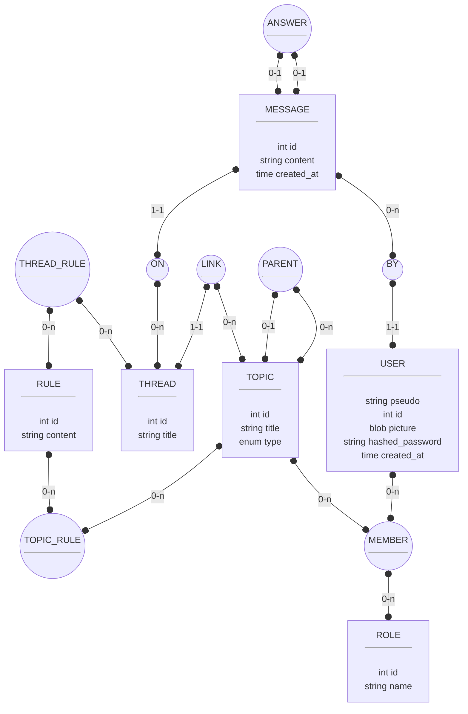

# Base de données

## Utilisateurs

Chaque utilisateur est identifié par un pseudo ainsi qu'un numéro d'identification. Par exemple, les mainteneurs actuels de ce projet auraient comme identifiant : `Skylord#65`, `Rhexephon#0`, `Manolo#0`.

## Architecture discussions

L'architecture des discussions est sous forme d'arborescence. Un _Topic_ (noeud de l'arbre) peut contenir lui même d'autres topics, ainsi qu'un  (ou plusieurs) _Thread_ (feuilles de l'arbre).

Un _Server_ est un _Topic_ dit **racine**, lui même n'étant contenu dans aucun autre topic. Il contient à minima un thread (qui soit ou non dans un sous-topic).

### Règles

Un _Thread_ peut être régit par des règles (par exemple, seul certains rôles peuvent envoyer des messages, ou un message ne peut pas répondre à un autre, etc.). Un _Topic_ peut aussi être régit par des règles, dans ce cas tous ses descendants (topics comme threads) seront régit par (au moins) ces règles.

## Messages

Un message peut (non obligatoire) répondre à un autre message.

## Schéma relationnel

