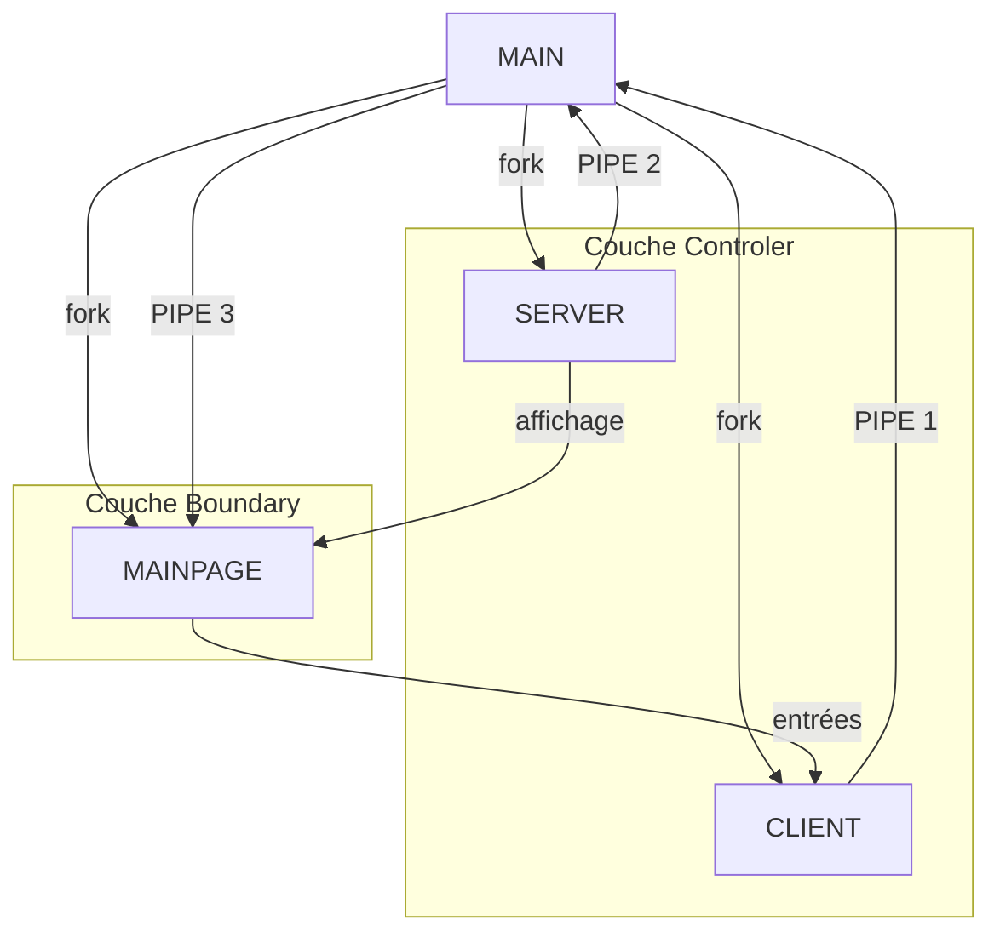

# Séparation fonctionnelle

## Main

Le main fork sur trois fichiers : `boundary/mainpage.c`, `controler/server.c`, `controler/client.c`.

### Server

Le server s'occupe de recevoir les messages.

### Client

Le client s'occupe d'envoyer les messages.

### MainPage

La mainpage s'occuper d'afficher et de prendre en entrée les messages.

## Communication

Il y a trois pipe : une entre client et main, une entre server et main, et une entre main et mainpage.